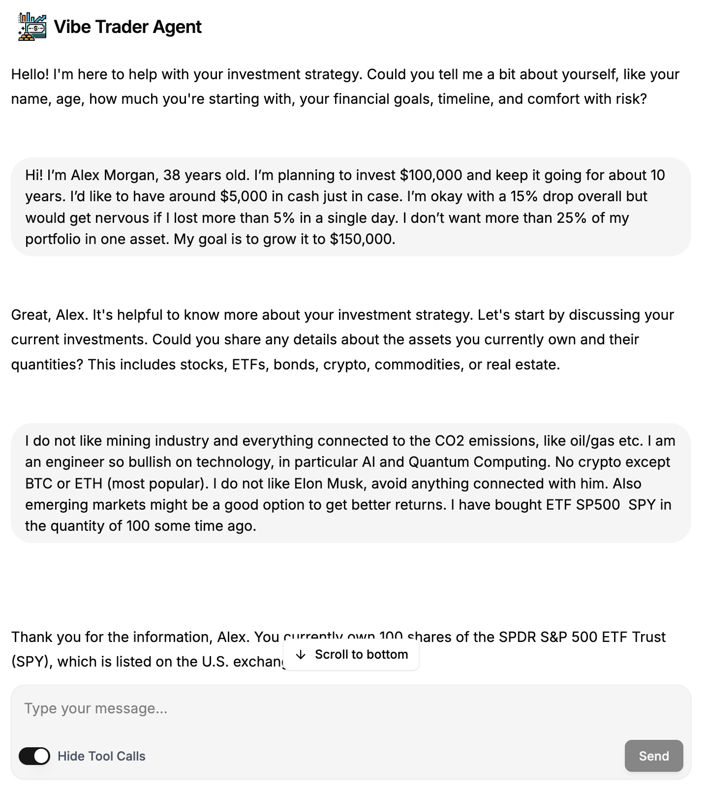

# Vibe Trader Agent UI

Vibe Trader Agent UI is a Next.js application which enables chatting with any LangGraph server with a `messages` key through a chat interface.



## Setup

```bash
git clone https://github.com/langchain-ai/agent-chat-ui.git

cd agent-chat-ui
```

Install dependencies:

```bash
pnpm install
```

Run the app locally:

```bash
pnpm dev
```

The app will be available at `http://localhost:3000`.

## Acknowledgments

This frontend is based on the [LangChain Agent Chat UI](https://github.com/langchain-ai/agent-chat-ui) repository.
